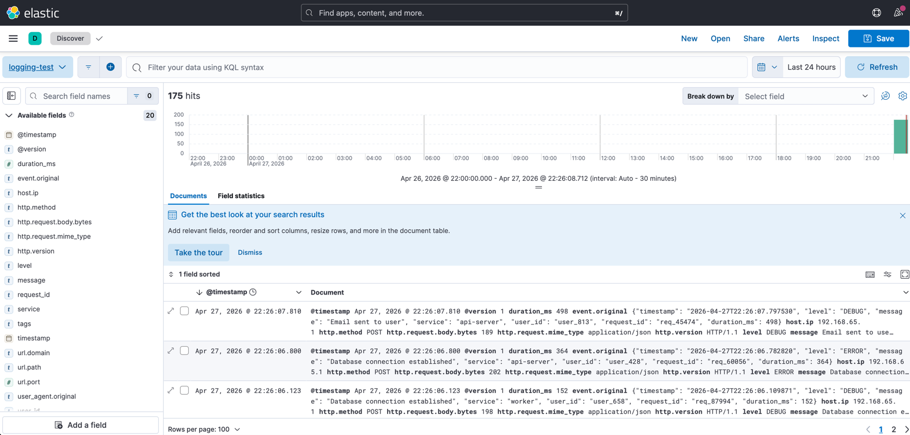

# logging-architecture-study
로깅 시스템 아키텍처 연습해보기

---

### 1. ELK 구성 (feature/elk-stack-tutorial)
실제 실무에서 ELK 환경에서 내가 만든 어플리케이션의 로그 수집을 하고 있긴 한데, 해당 환경을 내가 구성한게 아니다보니...ㅇㅂㅇ.. <br>
겸사겸사 이해 해볼 겸 설정



### 2. 수평 확장 공부해보기
load_test.py 돌려서 하나씩 체크해보는데, 중간 부하 버전으로만 해도 아래와 같은 결과를 얻음
```text
============================================================
📋 최종 결과
============================================================
총 전송 시도: 20,954건
✓ 성공: 20,954건
✗ 실패: 0건
📈 평균 처리율: 349.0 건/초
⏱️  테스트 시간: 60.0초

지연 시간 통계:
  평균: 6.6ms
  중앙값: 6.0ms
  P95: 12.0ms
  P99: 14.7ms
  최대: 18.1ms

💡 분석:
  ⚠️  목표 처리율의 69.8%만 달성
  → 현재 아키텍처의 한계입니다. 확장이 필요합니다.
============================================================
```
성공 자체는 다 했는데 전반적으로 지연됨이 확인됨
```text
NAME            CPU %     MEM USAGE / LIMIT
logstash        46.35%    753.6MiB / 7.667GiB
kibana          2.38%     655.6MiB / 7.667GiB
elasticsearch   24.52%    1.328GiB / 7.667GiB
```
컨테이너 자체는 그렇게 많이 쓰는것 같진 않고
```text
{
  "in": 24114,          // 들어온 로그
  "filtered": 23499,    // 필터 처리 완료
  "out": 23499,         // Elasticsearch로 전송
  "queue_push_duration_in_millis": 369,  // 큐 대기 시간 (짧음 = 좋음)
  "duration_in_millis": 42686  // 총 처리 시간
}
```
초당 처리량 = `23499` / `42.686` = 550 정도? <br>
엘라스틱서치만 보면 550 정도인데 실제 load_test 스크립트 돌린 결과에서 평균 처리율이 낮네...ㅇㅂㅇ <br>
```text
[load_test.py] --HTTP--> [Logstash] --> [Elasticsearch]
    331 req/s            550 req/s         353 req/s
```
logstach.conf 설정할때
```text
  http {
    port => 5044
    codec => json
  }
```
별도의 thread 설정을 주지 않았는데, 클로드에 말에 의하면 스레드 옵션을 별도로 주지 않으면 worker 개수 그대로 따라간다고 함 ㅇㅂㅇ

```text
jiemu@Jiemu-MacBook-Air  ~/IdeaProjects/logging-architecture-study   feature/elk-stack-tutorial ±✚  docker exec logstash nproc
8
```
스레드 2배로 늘리고 테스트 해봤는데 logstash 는 열심히 CPU 를 사용하는데 elasticsearch 가 변화 없고, 결정적으로 속도 병목도 별 차이가 없는거보니 다른 이유인듯?